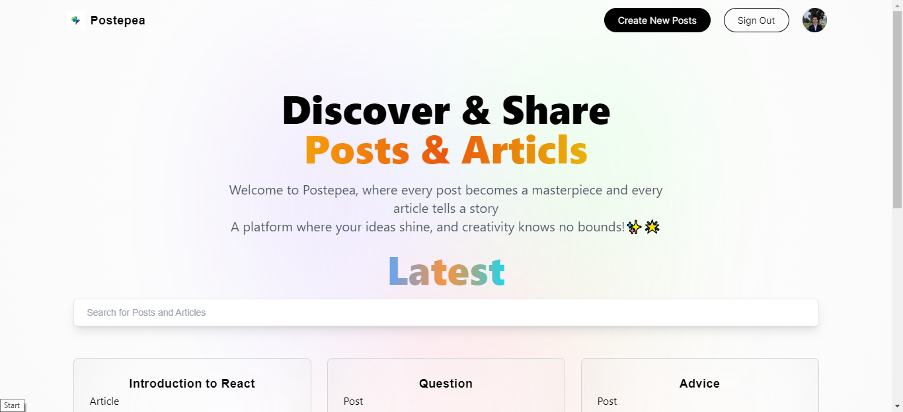
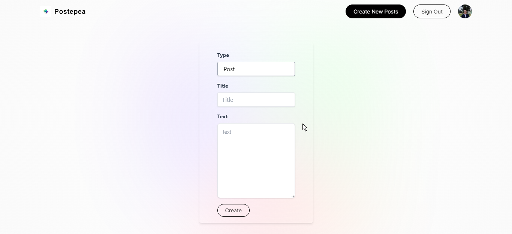
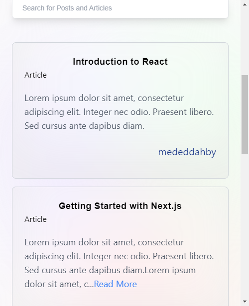

# 🌟 Postepea

Postepea is a web application crafted with ❤️ using Next.js 14 and Tailwind CSS. It provides users with a vibrant platform to read and compose engaging posts and articles. The authentication magic is powered by NextAuth, and the project is gracefully deployed on Vercel.
- **Production Realm**: [Explore the Magic](https://postepea.vercel.app/)


## 🚀 Tech Stack

[](https://nextjs.org/) [](https://tailwindcss.com/) [](https://next-auth.js.org/)

## ✨ Features

- **User Authentication**: Secure user authentication powered by NextAuth ensures a seamless and secure experience for users.

- **Read and Write**: Dive into a world of diverse content! Users can read posts and articles crafted by others and contribute their own after signing up.

- **Responsive Design**: The application sparkles with a responsive design, ensuring a delightful experience across various devices.

## ✅ Getting Started

To embark on this journey, follow these enchanted steps:

1. **Clone the Repository**:
   ```bash
   git clone https://github.com/mededdahby/Postepea.git
   ```

2. **Install Magical Dependencies**:
   ```bash
   cd Postepea
   npm install
   ```

3. **Set Up Environment Variables**:
   Create a `.env` file in the root directory and sprinkle in the necessary environment variables (e.g., API keys, database credentials).

4. **Summon the Application**:
   ```bash
   npm run dev
   ```

   The portal to Postepea will manifest at `http://localhost:3000`.

## 📸 Screenshots

| Home Page 🏡 | Write Post ✍️ |
|:---------:|:--------------:|
| [](path/to/fullsize/home.png) | [](path/to/fullsize/dashboard.png) |
| Additional 🎉 | Mobile Version 📱 |
| [](path/to/fullsize/additional.png) | [](path/to/fullsize/last_screenshot.png) |

## 🚀 Deployment

The magical project is deployed on Vercel. Any changes pushed to the main branch will automatically trigger a deployment.

**[Try it ](https://postepea.vercel.app/)**

## 🎉 Contributing

Contributions are like potions of creativity! If you'd like to contribute to Postepea, please follow the enchantments in [CONTRIBUTING.md](CONTRIBUTING.md).

## 📜 License

This project is charmed under the [MIT License](LICENSE).
